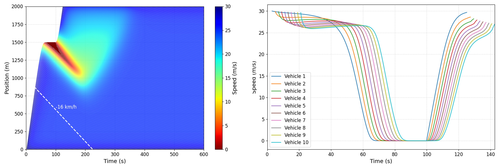
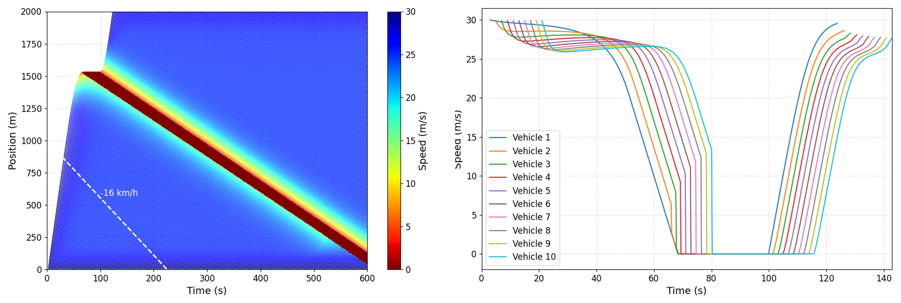
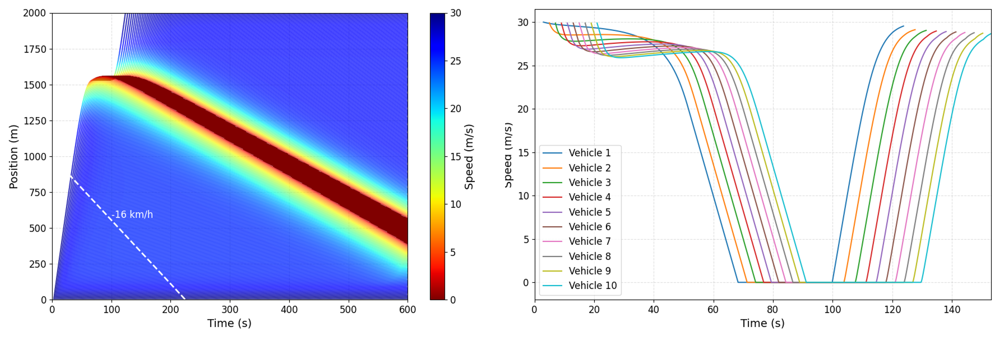
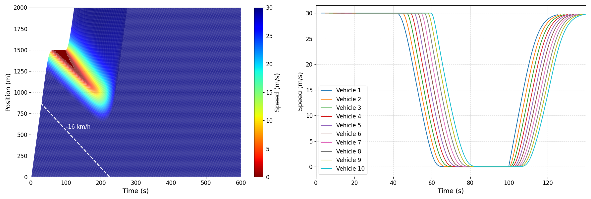

# Intelligent Driver Model and its Constraints in Coding

## Abstract
Background: When the simulated traffic behaves unexpectedly, adding extra constraints is the most direct and straightforward solution (e.g., enforcing speed>0, moving distance>0).

Model focused: Intelligent Driver Model (IDM) proposed by [Martin Treiber et al](https://arxiv.org/abs/cond-mat/0002177)

Conclusion: I found that 

* The original IDM seems to have some drawbacks (Experiment 1).
* Extra constraints largely influence the results of original IDM-based traffic flow simulation (Experiments 2 and 3).
* The IDM Plus seems more reasonable (Experiment 4).


Note 1: I don’t think directly implementing the model with arbitrary constraints in coding is a rigorous attitude.

Note 2: I’m fairly confident that there are no errors in the code. 
If you found errors or knew someone has improved the model, please kindly reach out to me (he.zb@hotmail.com), which will be very helpful!
I am particularly surprised that few studies actually report these (the conclusion was made based on my communication with some friends who are very familiar with the IDM), even though the IDM is now widely used in academia ([a review](https://arxiv.org/abs/2506.05909)) and industry (e.g., SUMO).


## Issues (Possible)

**Experiment 1 (Original IDM):** No extra constraints. I observe:
* After escaping the stop-and-go wave, the vehicle’s speed cannot return to high speed
* Wave speed = -16 km/h




**Experiment 2:** All constraints taking effect. I observe:
* The stop-and-go wave continuously propagates upstream
* The decelerating process is too sharp -- Here, it is the sharp deceleration, but it is still unknown for other scenarios. The extremely unfortunate case is: It would significantly affect the results if it happened in some critical moments.
* * Wave speed = -10 km/h




**Experiment 3:** Only Constraint 2 not taking effect. I observe:
* Collision occurs
* * Wave speed = -9 km/h




**Experiment 4 (IDM Plus):** No extra constraints. I observe: 
* This seems to be very reasonable.
* * Wave speed = -16 km/h




## IDM 
* Original IDM
  
$$
a = a^* \left(1 - \left(\frac{v}{v_0}\right)^4 - \left(\frac{s^*(v,\Delta v)}{s}\right)^2 \right)
$$

* IDM Plus

$$
a = \min\Biggl[ a^* \Bigl( 1 - \Bigl( \frac{v}{v_0} \Bigr)^4 \Bigr), \ a^* \Bigl( 1 - \frac{s^*(v, \Delta v)}{s} \Bigr)^2 \Biggr]
$$


## Constraints
Constraint 1: in _vehicle.update_acceleration()_
```python
# -------------------------------        
### Additional Constraint 1
if self.with_additional_constraint_1 is True:
    if a < -b_desired:
        a = -b_desired
    if a > a_max:
        a = a_max
# -------------------------------    
```


Constraint 2: in _vehicle.update_speed()_
```python
# -------------------------------        
### Additional Constraint 2
if self.with_additional_constraint_2 is True:            
    if self.vehicle_front is not None:
        s = self.vehicle_front.position - self.position - self.L
        s = max(s, 0.01)  # prevent division by zero
        v_max_allowed = s / delta_t
        v_new = min(v_new, v_max_allowed)
# -------------------------------      
```


Constraint 3: in _vehicle.update_acceleration()_
```python
# -------------------------------        
### Additional Constraint 3
if self.with_additional_constraint_3 is True:
    s = max(s, 0.1) 
# -------------------------------
```


Constraint 4: in  _vehicle.update_speed()_
```python
# -------------------------------        
### Additional Constraint 4
if self.with_additional_constraint_4 is True:
    v_new = max(v_new, 0)
# -------------------------------
```


Constraint 5: in  _vehicle.update_position()_
```python
# -------------------------------   
### Additional Constraint 5
if self.with_additional_constraint_5 is True:
    d = max(d, 0)
# -------------------------------
```


## Citation
If you find this work useful, please consider citing the project

```bibtex
@misc{ZhengbingHe2025,
  author = {He, Zhengbing},
  title = {Intelligent Driver Model and its Constraints in Coding},
  howpublished = {\url{https://github.com/gotrafficgo/idm_and_constraints}},
  year = {2025},
  note = {GitHub repository}
}
