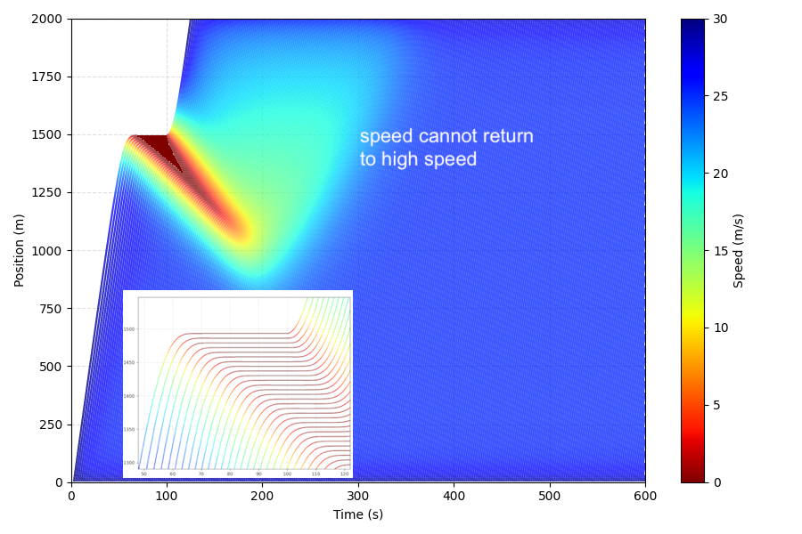
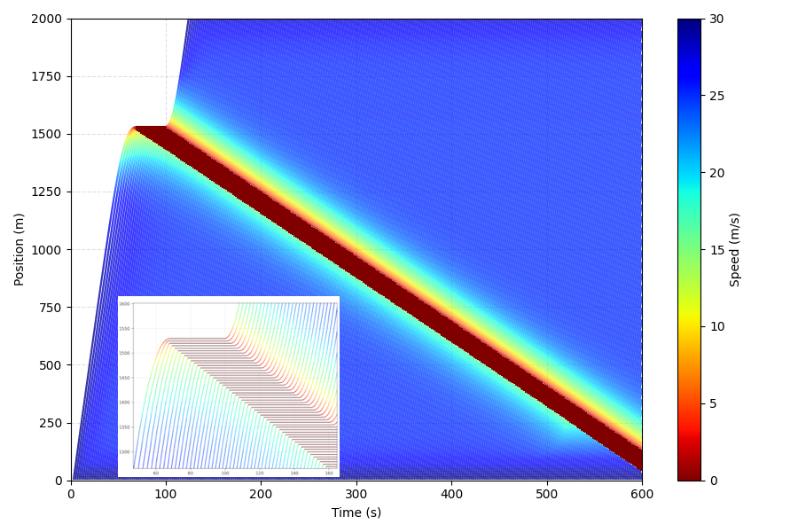
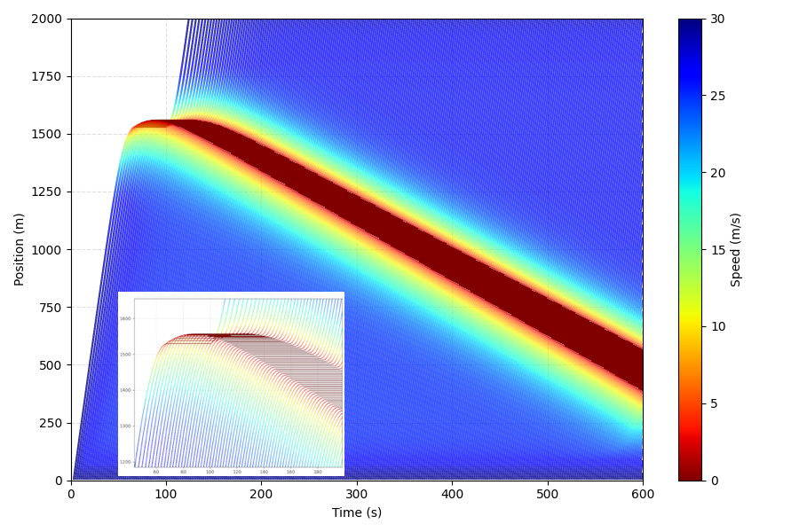

# Intelligent Driver Model and its Constrants in Coding

## Abstract
I found the additional constraints largely influence the results of IDM-based traffic flow simulation. I report some of them here. _I don’t think directly implementing the model with arbitrary constraints in coding is a rigorous attitude._

Note 1: The well-known Intelligent Driver Model (IDM) proposed by [Martin Treiber et al](https://arxiv.org/abs/cond-mat/0002177). 

Note 2: I’m fairly confident that there are no errors in the code. 
If you found errors or knew someone has improved the model, please kindly reach out to me (he.zb@hotmail.com), which will be very helpful!
I am particularly surprised that few studies actually report these, even though the IDM is now widely used in academia ([a review](https://arxiv.org/abs/2506.05909)) and industry (e.g., SUMO).
PROVE ME WRONG, please.


## Scenario

* Straight road (open boundary)
* Entering the road with fixed time interval
* Simulation time step = 0.1 second
* IDM parameters:
  minimum_spacing = 2; safety_time_headway = 1.2; maximum acceleration = 2 desired_deceleration = 1.2
* **Bottleneck:** Before the very first vehicle, we set up a virual standstill obstacle (speed = 0), taking effect only before a given time (100 seconds); after the given time, no such limitation
* ```python
    def _generate_boundary_for_first_vehicle(self, current_time):
        ...   
  ```


## Issues (Possible)

**Experiment 1 (Original IDM):** No constraints taking effect. I observe:
* The stop-and-go wave does not continously propagate upstream
* After escaping the stop-and-go wave, the vehicle’s speed cannot return to high speed
* Wave speed = -16 km/h




**Experiment 2:** All constraints taking effect. I observe:
* The stop-and-go wave does continously propagate upstream
* The decelerating process is too sharp -- Here, it is the sharp deceleration, but it is still unknown for other scenarios. The extremely unfortnate case is: It would be significantly affect the results, if it happens in some critical moments.
* * Wave speed = -10 km/h
  



**Experiment 3:** Only Constraint 2 not taking effect. I observe:
* Collision occurs
* * Wave speed = -9 km/h




## Constraints
Constraint 1: in _vehicle.update_acceleration()_
```python
# -------------------------------        
### Additional Constraint 1
if self.with_additional_constraint_1 is True:
    if a < -b_desired:
        a = -b_desired
    if a > a_max:
        a = a_max
# -------------------------------    
```


Constraint 2: in _vehicle.update_speed()_
```python
# -------------------------------        
### Additional Constraint 2
if self.with_additional_constraint_2 is True:            
    if self.vehicle_front is not None:
        s = self.vehicle_front.position - self.position - self.L
        s = max(s, 0.01)  # prevent division by zero
        v_max_allowed = s / delta_t
        v_new = min(v_new, v_max_allowed)
# -------------------------------      
```


Constraint 3: in _vehicle.update_acceleration()_
```python
# -------------------------------        
### Additional Constraint 3
if self.with_additional_constraint_3 is True:
    s = max(s, 0.1) 
# -------------------------------
```


Constraint 4: in  _vehicle.update_speed()_
```python
# -------------------------------        
### Additional Constraint 4
if self.with_additional_constraint_4 is True:
    v_new = max(v_new, 0)
# -------------------------------
```


Constraint 5: in  _vehicle.update_position()_
```python
# -------------------------------   
### Additional Constraint 5
if self.with_additional_constraint_5 is True:
    d = max(d, 0)
# -------------------------------
```


## Citation
If you find this work useful, please consider citing the project

```bibtex
@misc{ZhengbingHe2025,
  author = {He, Zhengbing},
  title = {Intelligent Driver Model and its Constraints in Coding},
  howpublished = {\url{https://github.com/gotrafficgo/idm_and_constraints}},
  year = {2025},
  note = {GitHub repository}
}
